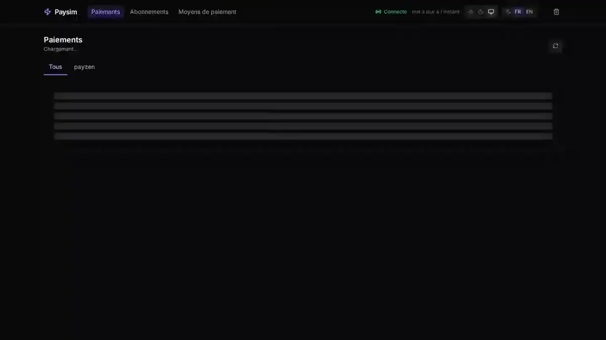

> [🇬🇧 English](README.md) · [🇫🇷 Français](README.fr.md)

# Paysim


> Fake payment provider that provokes the failures a sandbox refuses to reproduce.

> [!WARNING]
> Paysim is a simulator built for development and automated testing. It
> processes no real payment, contacts no financial institution, and must
> never be deployed to production nor exposed on a public network. The
> credentials and HMAC keys given throughout the documentation are public
> demonstration values: any instance reachable from the Internet is to be
> considered open to everyone.



<sub>Twenty seconds against a live instance — [full walkthrough (42 s)](docs/assets/demo-complete.webp).</sub>

## What Paysim is

Paysim is a self-hosted fake payment provider. It reproduces the wire
protocol of a real PSP (PayZen today, Stripe next) faithfully enough
that a real merchant integration talks to it without modification —
same endpoints, same signatures, same webhook shapes.

## Why Paysim exists

Sandboxes always succeed. Real payments don't. The most valuable
integration tests aren't "does capture work" — sandboxes cover that
— but "does my merchant survive when capture returns 500 halfway,
when the webhook arrives before the HTTP response, when the same
webhook is delivered twice, when 3DS is abandoned, when the customer
is declared unpaid three days later". Paysim is what you use to
provoke these on demand, in dev and in CI.

## What you can do with it

- Race the webhook against the HTTP response (the one race a sandbox never gives you).
- Reorder or duplicate webhook delivery.
- Inject latency, 5xx errors, invalid signatures.
- Decline with magic amounts, magic PANs, expired cards, revoked tokens.
- Replay any webhook from the UI or the API.

## Providers

| Provider | API | Coverage |
|---|---|---|
| PayZen / Lyra Collect | REST V4 | Full — see [`docs/providers/payzen.md`](docs/providers/payzen.md) |
| Stripe | — | Later |

## Quick start (Docker Compose)

Get the source first (same command on both platforms):

```bash
git clone https://github.com/sprimault/paysim.git
cd paysim
```

Then (no local build needed — `docker compose` pulls the prebuilt
image from `ghcr.io/sprimault/paysim:latest`, multi-arch amd64+arm64):

**Linux / macOS / Git Bash:**

```bash
docker compose -f deploy/compose.yml up -d
bash examples/seed-paysim.sh
# http://localhost:30880/

# Re-run to reset payments to a clean state (the seed isn't idempotent):
bash examples/seed-paysim.sh --purge
```

**Windows PowerShell:**

```powershell
docker compose -f deploy/compose.yml up -d
.\examples\seed-paysim.ps1
# http://localhost:30880/

# Re-run to reset payments to a clean state:
.\examples\seed-paysim.ps1 -Purge
```

Override `PAYSIM_HOST_PORT` (and pass the same to `PAYSIM_URL` on
the seed line) if `30880` is already taken on the machine.

**Linux / macOS / Git Bash:**

```bash
PAYSIM_HOST_PORT=30890 docker compose -f deploy/compose.yml up -d
PAYSIM_URL=http://localhost:30890 bash examples/seed-paysim.sh --purge
# http://localhost:30890/
```

**Windows PowerShell:**

```powershell
$env:PAYSIM_HOST_PORT="30890"; docker compose -f deploy/compose.yml up -d
$env:PAYSIM_URL="http://localhost:30890"; .\examples\seed-paysim.ps1 -Purge
# http://localhost:30890/
```

Rebuild after code changes — forces image rebuild and container recreate.
Same command on both platforms:

**Linux / macOS / Git Bash:**

```bash
docker compose -f deploy/compose.yml up -d --build --force-recreate
```

**Windows PowerShell:**

```powershell
docker compose -f deploy/compose.yml up -d --build --force-recreate
```

If it fails with `No such container`, Docker Compose lost track of the
container state (manual `docker rm` outside compose, etc.). Reset first:

**Linux / macOS / Git Bash:**

```bash
docker compose -f deploy/compose.yml down --remove-orphans
docker compose -f deploy/compose.yml up -d
```

**Windows PowerShell:**

```powershell
docker compose -f deploy/compose.yml down --remove-orphans
docker compose -f deploy/compose.yml up -d
```

The seed script populates the UI with a varied dataset — payments,
subscriptions, payment methods in every visual state (captured,
declined, active, revoked, expired). Useful for a first walkthrough.

## Try it without cloning

If you just want to see Paysim running for 5 minutes without touching
git, run the image directly (no seed data, no persistence). Same
one-liner works on Linux/macOS/Git Bash and Windows PowerShell:

```bash
docker run --rm -p 30880:8080 -e PAYSIM_PUBLIC_URL=http://localhost:30880 -e PAYSIM_CALLBACK_URL=http://localhost:30880 -e PAYSIM_PAYZEN_HMAC_KEY=dev-hmac-key -e PAYSIM_PAYZEN_REST_PASSWORD=dev-rest-password ghcr.io/sprimault/paysim:latest
```

Then browse to http://localhost:30880/.

For the full demo with populated UI (subscriptions, payment methods),
use the Docker Compose quick start above — it enables SQLite and runs
the seed script.

## Full install

[`docs/install.md`](docs/install.md) covers Docker Compose, Kubernetes
(NodePort or Ingress), the **two-URL matrix** (the section you're
actually looking for), and optional SQLite persistence.

## Four rejection levers

Magic amounts ending in `01`, `02` or `04` — each with its own bank
reason — four canonical magic PANs, card expiration, token revocation.
Details in
[`docs/testing-cards.md`](docs/testing-cards.md).

## Scenarios (YAML)

Replay a payment flow in CI without hand-writing curl. Canonical
scenarios live in [`examples/scenarios/`](examples/scenarios/). Run
one against the container:

**Linux / macOS / Git Bash:**

```bash
docker compose -f deploy/compose.yml cp examples/scenarios/one-shot.yml paysim:/tmp/one-shot.yml
docker compose -f deploy/compose.yml exec -e PAYSIM_URL=http://localhost:8080 paysim /paysim run /tmp/one-shot.yml
```

**Windows PowerShell:**

```powershell
docker compose -f deploy/compose.yml cp examples/scenarios/one-shot.yml paysim:/tmp/one-shot.yml
docker compose -f deploy/compose.yml exec -e PAYSIM_URL=http://localhost:8080 paysim /paysim run /tmp/one-shot.yml
```

A minimal scenario file looks like:

```yaml
- action: create_payment
  amount: 4990
  currency: EUR
  register: true
  card: { pan: "4111111111111111", expiry_month: 12, expiry_year: 2028 }
- action: assert_state
  state: captured
```

11 actions supported. See [`docs/scenarios.md`](docs/scenarios.md).

## PHP integration example

Switching a PayZen integration to Paysim is one URL change:

```php
$client = new PayzenClient([
    'endpoint'  => 'http://localhost:30880',  // was https://api.payzen.eu
    'username'  => '00000000',                 // any non-empty value
    // Signs server notifications — matches PAYSIM_PAYZEN_REST_PASSWORD
    'password'  => 'dev-rest-password',
    // Signs the browser return — matches PAYSIM_PAYZEN_HMAC_KEY
    'hmac_key'  => 'dev-hmac-key',
]);
$response = $client->post('/api-payment/V4/Charge/CreatePayment', [...]);
```

Full merchant with webhook verification: [`examples/php`](examples/php/README.md).

Or directly with `curl` — same body a PayZen REST V4 client would send.

**Linux / macOS / Git Bash:**

```bash
curl -X POST http://localhost:30880/api-payment/V4/Charge/CreatePayment \
  -u 00000000:testpassword_XXXX \
  -H 'Content-Type: application/json' \
  -d '{"amount":4990,"currency":"EUR","orderId":"CMD-42","customer":{"email":"a@b.io"}}'
```

**Windows PowerShell** (native — `curl` is an alias for `Invoke-WebRequest`
with a different syntax, so use `Invoke-RestMethod` here):

```powershell
$cred = New-Object PSCredential('00000000', (ConvertTo-SecureString 'testpassword_XXXX' -AsPlainText -Force))
Invoke-RestMethod -Method Post -Uri http://localhost:30880/api-payment/V4/Charge/CreatePayment `
  -Credential $cred -ContentType 'application/json' `
  -Body '{"amount":4990,"currency":"EUR","orderId":"CMD-42","customer":{"email":"a@b.io"}}'
```

## Web UI

Embedded React SPA served at the same port as the API (default
`http://localhost:30880/`) — payments, subscriptions, payment
methods, webhooks (with one-click replay), all live via SSE. Dark
mode, auto-reload when a new build is deployed, refresh button per
view.

## Published images

| Tag      | Contents                  | When it moves       |
| -------- | ------------------------- | ------------------- |
| `latest` | Latest stable release     | on every release    |
| `edge`   | State of `master`         | on every merged PR  |

```bash
docker pull ghcr.io/sprimault/paysim:latest   # stable
docker pull ghcr.io/sprimault/paysim:edge     # one release ahead
```

`edge` exists so that a fix is installable without waiting for a version. CI
publishes it **after** the linter, the tests, the audit and the seven canonical
scenarios have passed — never from a pull request. Like `latest`, it is
multi-architecture, amd64 and arm64.

Running `edge` in production makes no sense: nothing guarantees interface
stability between two merges.

## Status

Preview release, tag `v0.6.6`. Stripe support is planned.

**How it is validated.** Every pull request runs the linter, the unit tests
with the race detector, a dependency audit, a drift check on the TypeScript
types generated from the Go structs, and the seven canonical scenarios
against a real binary, in both storage modes — memory and SQLite. The
workflow is public and its runs are in the Actions tab. The `kr-hash`
signature is checked against the IETF RFC 4231 vectors and against a
vector from Lyra's official Java SDK — neither is produced by our own
code.

Most fixes come from use rather than theory: wiring Paysim into a merchant
integration surfaces what no unit test shows — a field silently dropped at
decoding, a decline reason that never reaches the merchant, an alias not
carrying its customer. Each of those defects then becomes a scenario, so
that it cannot come back.

## Feedback

Bugs, feature requests, or questions: open an issue at
https://github.com/sprimault/paysim/issues (French preferred,
English welcome).

Planning to send a patch? [`CONTRIBUTING.md`](CONTRIBUTING.md) states the
rules a pull request is judged against — they are not obvious from the
code, and none of them is negotiable inside a pull request.

Security flaws go through the private channel described in
[`SECURITY.md`](SECURITY.md), never through a public issue.

## License

Apache 2.0 — see [`LICENSE`](LICENSE).
