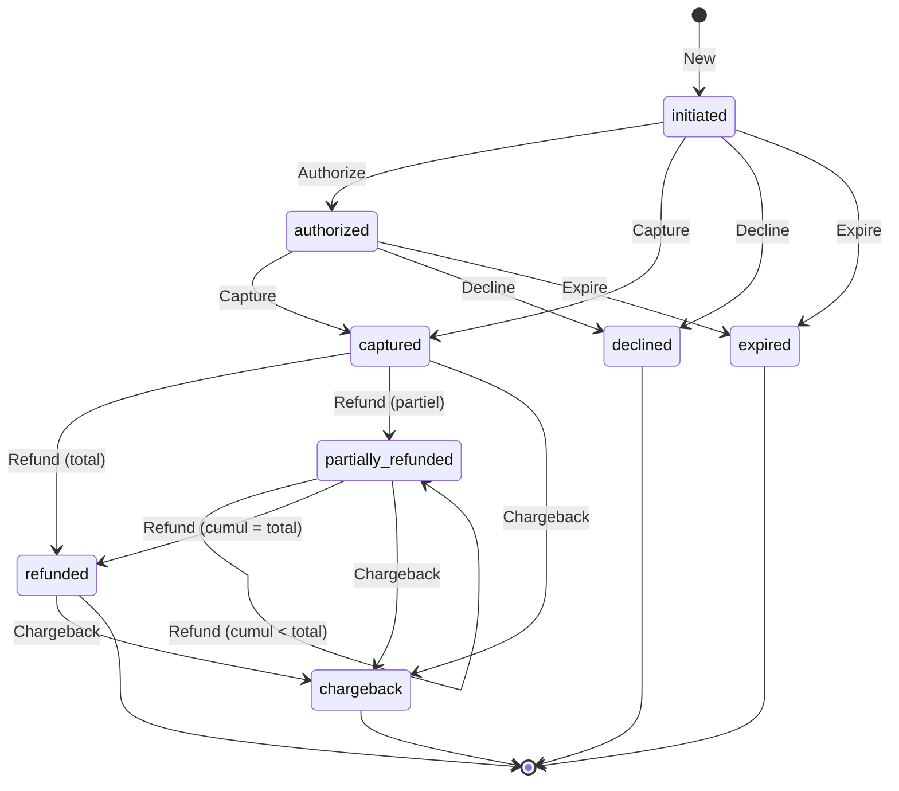

> [🇬🇧 English](states.md) · [🇫🇷 Français](states.fr.md)

# Machine à états du paiement

Ce document est la source unique pour la machine à états implémentée dans
`internal/domain`. Toute divergence entre le code et ce document est un bug à
corriger — au cas par cas, mais le graphe canonique reste ci-dessous.

## Diagramme

## États

| État                 | Terminal | Description                                                       |
| -------------------- | :------: | ----------------------------------------------------------------- |
| `initiated`          |    non   | Paiement créé, aucune interaction PSP encore.                     |
| `authorized`         |    non   | Fonds réservés (mode 3DS + capture différée), non débités.        |
| `captured`           |    non   | Fonds effectivement débités.                                      |
| `partially_refunded` |    non   | Un ou plusieurs remboursements partiels, cumul strictement < total. |
| `refunded`           |  **oui** | Remboursements intégraux, cumul égal au total.                    |
| `declined`           |  **oui** | Refus (banque, 3DS échoué, risque, autorisation annulée).         |
| `expired`            |  **oui** | Délai dépassé (formulaire non complété, autorisation expirée).    |
| `chargeback`         |  **oui** | Rétrofacturation reçue depuis un état où des fonds étaient débités. |

## Table des transitions valides

Lecture : ligne = état source, colonne = action, cellule = état d'arrivée
(`—` = transition interdite, renvoie `ErrInvalidTransition`).

|                        | Authorize    | Capture   | Refund                          | Decline    | Expire    | Chargeback   |
| ---------------------- | ------------ | --------- | ------------------------------- | ---------- | --------- | ------------ |
| **initiated**          | `authorized` | `captured` | —                               | `declined` | `expired` | —            |
| **authorized**         | —            | `captured` | —                               | `declined` | `expired` | —            |
| **captured**           | —            | —         | `partially_refunded` / `refunded` | —          | —         | `chargeback` |
| **partially_refunded** | —            | —         | `partially_refunded` / `refunded` | —          | —         | `chargeback` |
| **refunded**           | —            | —         | —                               | —          | —         | `chargeback` |
| **declined**           | —            | —         | —                               | —          | —         | —            |
| **expired**            | —            | —         | —                               | —          | —         | —            |
| **chargeback**         | —            | —         | —                               | —          | —         | —            |

L'état d'arrivée de `Refund` dépend du cumul : `refunded` si le cumul atteint
exactement le total, `partially_refunded` sinon.

## Points subtils

**Auto-transition `partially_refunded → partially_refunded`.** Un remboursement
partiel supplémentaire n'est pas un changement d'état, mais c'est un événement
métier qui doit apparaître à la chronologie. Le journal d'événements est donc
la source de vérité : chaque appel réussi à `Refund` produit exactement un
événement `refunded`, y compris quand l'état reste identique.

**`chargeback` depuis `refunded`.** C'est contre-intuitif — pourquoi contester
après avoir été remboursé ? Parce que c'est un scénario de fraude documenté :
le fraudeur reçoit le remboursement du commerçant, puis déclenche la
rétrofacturation auprès de sa banque pour être payé une seconde fois. La
transition est autorisée, elle porte un vrai signal métier.

**Distinction événement / changement d'état.** L'état résume ; le journal
raconte. Toute méthode qui réussit inscrit un événement au journal, même si
l'état ne bouge pas (cas ci-dessus). Toute méthode qui échoue (transition
interdite, montant invalide) ne modifie rien — ni l'état, ni le journal.

**Pas de capture partielle.** `Capture` transfère toujours l'intégralité du
montant demandé. La capture partielle existe chez certains PSP (notamment pour
les commandes expédiées en plusieurs colis) mais elle est **hors périmètre
phase 0**. Si elle devient nécessaire, elle s'ajoutera comme un mode de
`Capture(amount format.Amount)` — et il faudra revoir le contrat de `Refund`
dont la borne haute deviendra le montant capturé, plus le montant demandé.

**Erreurs et invariants.**
- `ErrInvalidTransition` : la méthode n'est pas autorisée depuis l'état
  courant. L'état et le journal sont laissés strictement inchangés.
- `ErrInvalidAmount` : montant nul, négatif, ou cumul de remboursements qui
  dépasserait le total capturé. Idem, rien n'est modifié.
- Un paiement dans un état terminal est **irrémédiablement inerte** — sauf
  `refunded` qui peut encore recevoir un `Chargeback`.

## Implémentation

Le code est dans `internal/domain/` :

- `state.go` — type `State` et constantes.
- `event.go` — type `Event`, `EventKind` et constantes.
- `payment.go` — struct `Payment`, constructeur `New`, méthodes de transition.
- `errors.go` — sentinelles.
- `payment_test.go` — matrice exhaustive des transitions valides et interdites.

Un test d'architecture (`internal/arch/arch_test.go`) vérifie que `domain`
n'importe aucun paquet fournisseur : cette machine à états est indépendante de
tout PSP, c'est ce qui rend le moteur de chaos et l'ajout d'un fournisseur
mécaniques.
