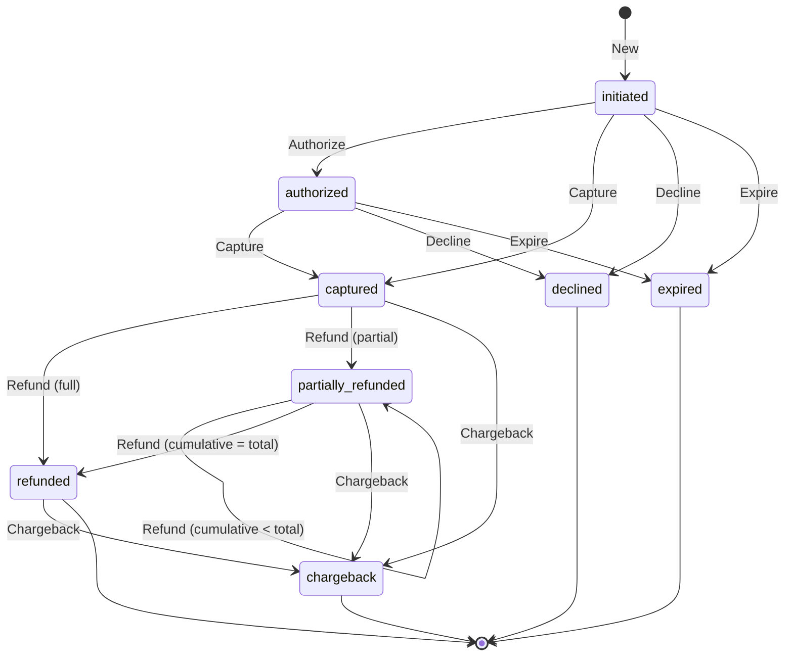

> [🇬🇧 English](states.md) · [🇫🇷 Français](states.fr.md)

# Payment state machine

This document is the single source of truth for the state machine implemented
in `internal/domain`. Any divergence between the code and this document is a
bug to fix — case by case, but the canonical graph stays here.

## Diagram

## States

| State                | Terminal | Description                                                          |
| -------------------- | :------: | -------------------------------------------------------------------- |
| `initiated`          |    no    | Payment created, no PSP interaction yet.                             |
| `authorized`         |    no    | Funds reserved (3DS + delayed capture mode), not debited.            |
| `captured`           |    no    | Funds effectively debited.                                           |
| `partially_refunded` |    no    | One or more partial refunds, cumulative strictly < total.            |
| `refunded`           |  **yes** | Full refunds, cumulative equals the total.                           |
| `declined`           |  **yes** | Rejected (bank, failed 3DS, risk score, authorization voided).       |
| `expired`            |  **yes** | Timeout (form not completed, authorization expired).                 |
| `chargeback`         |  **yes** | Chargeback received from a state where funds had been debited.       |

## Valid transitions table

How to read: row = source state, column = action, cell = destination state
(`—` = forbidden transition, returns `ErrInvalidTransition`).

|                        | Authorize    | Capture   | Refund                            | Decline    | Expire    | Chargeback   |
| ---------------------- | ------------ | --------- | --------------------------------- | ---------- | --------- | ------------ |
| **initiated**          | `authorized` | `captured` | —                                 | `declined` | `expired` | —            |
| **authorized**         | —            | `captured` | —                                 | `declined` | `expired` | —            |
| **captured**           | —            | —         | `partially_refunded` / `refunded` | —          | —         | `chargeback` |
| **partially_refunded** | —            | —         | `partially_refunded` / `refunded` | —          | —         | `chargeback` |
| **refunded**           | —            | —         | —                                 | —          | —         | `chargeback` |
| **declined**           | —            | —         | —                                 | —          | —         | —            |
| **expired**            | —            | —         | —                                 | —          | —         | —            |
| **chargeback**         | —            | —         | —                                 | —          | —         | —            |

The destination state of `Refund` depends on the cumulative amount: `refunded`
if it reaches the total exactly, `partially_refunded` otherwise.

## Subtle points

**Self-transition `partially_refunded → partially_refunded`.** An additional
partial refund is not a state change, but it is a business event that must
appear on the timeline. The event journal is therefore the source of truth:
every successful call to `Refund` produces exactly one `refunded` event, even
when the state stays the same.

**`chargeback` from `refunded`.** Counter-intuitive — why dispute after having
been refunded? Because it's a documented fraud scenario: the fraudster
receives the merchant's refund, then triggers a chargeback with their bank to
get paid a second time. The transition is allowed and carries a real business
signal.

**Event vs. state change distinction.** State summarises; the journal tells
the story. Any method that succeeds records an event in the journal, even
when the state doesn't move (see above). Any method that fails (forbidden
transition, invalid amount) changes nothing — neither the state, nor the
journal.

**No partial capture.** `Capture` always transfers the full requested amount.
Partial capture exists in some PSPs (notably for orders shipped in several
parcels) but it is **out of scope for now**. If it becomes necessary, it
will be added as a mode of `Capture(amount format.Amount)` — and the contract
of `Refund` will need revisiting, since its upper bound would become the
captured amount rather than the requested one.

**Errors and invariants.**
- `ErrInvalidTransition`: the method is not allowed from the current state.
  State and journal are left strictly unchanged.
- `ErrInvalidAmount`: zero, negative, or cumulative refunds that would exceed
  the captured total. Same behaviour, nothing is modified.
- A payment in a terminal state is **irremediably inert** — except `refunded`
  which can still receive a `Chargeback`.

## Implementation

The code lives in `internal/domain/`:

- `state.go` — `State` type and constants.
- `event.go` — `Event` and `EventKind` types with constants.
- `payment.go` — `Payment` struct, `New` constructor, transition methods.
- `errors.go` — sentinel errors.
- `payment_test.go` — exhaustive matrix of valid and forbidden transitions.

An architecture test (`internal/arch/arch_test.go`) checks that `domain`
imports no provider package: this state machine is independent of any PSP,
which is what makes the chaos engine and the addition of a provider
mechanical.
